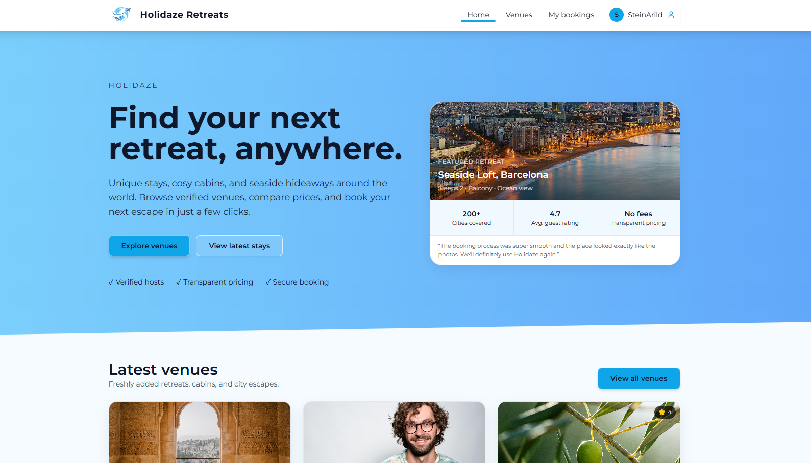
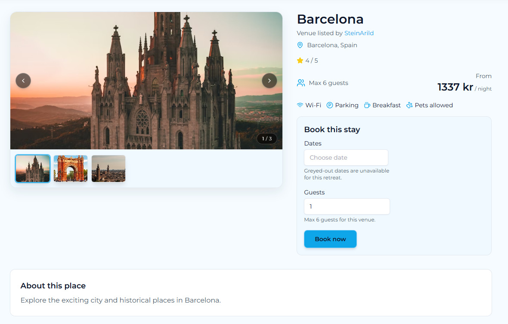
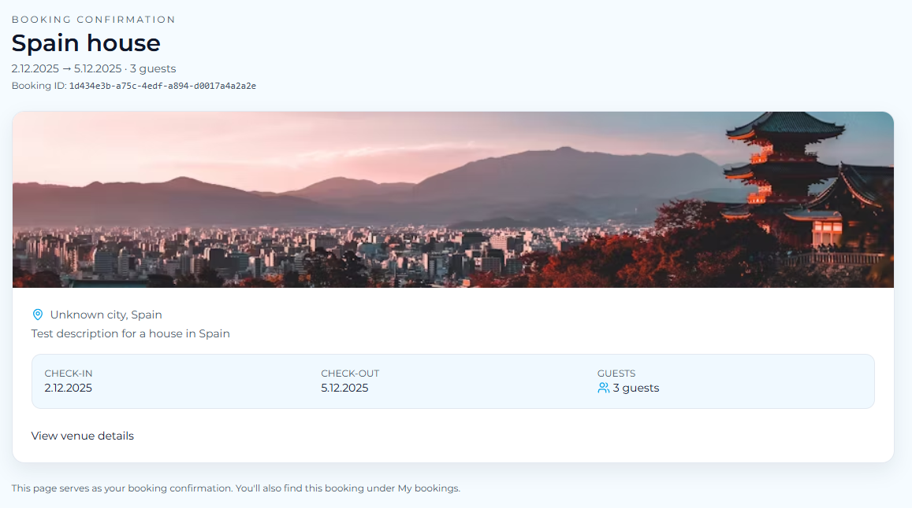
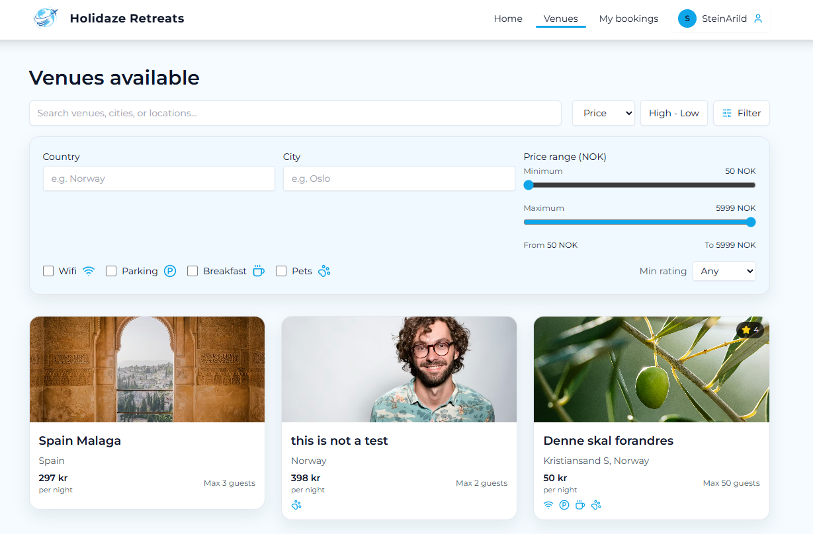
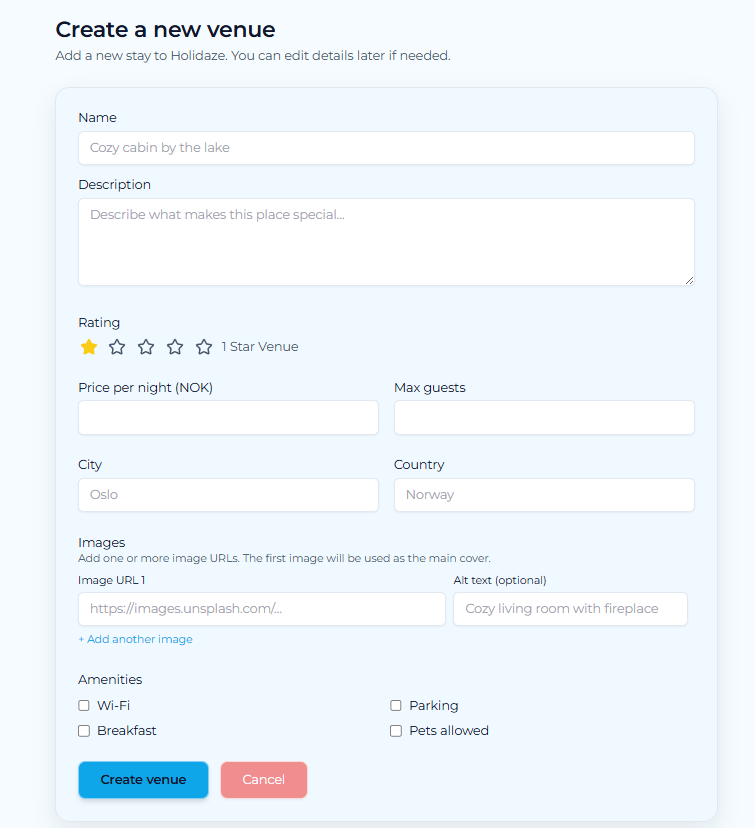

# 🏡 Holidaze Retreats

Modern venue booking platform | Project Exam 2 (PE2)

Holidaze Retreats is a premium booking experience built with React, TypeScript, and Tailwind.  
Users can browse venues, book stays, manage listings, and edit profiles, all powered by the Noroff API.

**Live site:** [Holidaze Retreats](https://holidaze-retreats.vercel.app/)
**Repository:** [Holidaze Repo](https://github.com/Arkuradev/holidaze-retreats)

---

## 📸 Screenshots

| Home | Venue Details | Booking Confirmation |
|------|---------------|--------------|
|  |  |  |
| Search | Manage Venues | Create Venue |
|  |  |  |


## 🔥 Features

### 👥 Public Users

- Browse all venues
- Venue details with gallery + carousel
- Search by name, location, tags
- Filter by price, amenities, and more
- View host profiles

### 🧑‍💼 Registered Users

- Register/login with @stud.noroff.no
- Book venues with date validation & conflict checking
- View bookings with receipts
- Edit user profile (avatar, banner, bio)
- View their own profile page

### 🏡 Venue Managers

- Turn on “Venue Manager” when registering
- Create venues with multiple images
- Edit or delete venues
- Dashboard view of all managed venues
- See bookings on owned venues

### 🎨 UI & UX

- Premium styling using Tailwind
- Skeleton loaders for all major pages
- Toast notifications
- Smooth scroll restoration
- Mobile-first responsive layout
- Accessible and WCAG-compliant components

---

## 🧱 Tech Stack

### Frontend

- React 18
- TypeScript
- Tailwind CSS
- React Router
- Lucide Icons
- React Datepicker

### Tools

- Vite
- ESLint + Prettier

### Deployment

- Vercel (recommended)

---

## 🚀 Installation & Setup

### Clone repo

```bash
git clone https://github.com/Arkuradev/holidaze-retreats.git
cd holidaze-retreats
npm install
```

### local env file (`.env.local`)

```bash
VITE_NOROFF_API_KEY="add_your_api_key_here"
VITE_BASE_API_URL="https://v2.api.noroff.dev"
```

### ⚠️ Important

If you rename any of these environment variables, you must also update the references inside your
`apiFetch` (or equivalent API utility).
Your fetch wrapper expects:
```ts
import.meta.env.VITE_BASE_API_URL;
import.meta.env.VITE_NOROFF_API_KEY;
```
These environment variables are used by the custom `apiFetch` wrapper to handle:
- Base URL for all API requests  
- Required API key for protected endpoints 

> 🔒 Your `.env.local` file should never be committed to Git. It is ignored by default via `.gitignore`.

### Start dev server

```bash
npm run dev
```

### Check build for production

```bash
npm run build
```

## 📁 Project Structure

```css
src/
  components/
    layout/
    venues/
    skeletons/
    forms/
    ui/
  pages/
  context/
  hooks/
  lib/
  types/
  assets/
  index.css
  main.tsx
```

## 🌐 Noroff API (v2)

Base URL: `https://v2.api.noroff.dev`

### Endpoints used

#### 🔐 Auth
- `POST /auth/register`
- `POST /auth/login`

#### 🏡 Venues
- `GET /holidaze/venues`
- `GET /holidaze/venues/:id`
- `POST /holidaze/venues`
- `PUT /holidaze/venues/:id`
- `DELETE /holidaze/venues/:id`

#### 📅 Bookings
- `GET /holidaze/bookings/:id`
- `POST /holidaze/bookings`
- `DELETE /holidaze/bookings/:id`

#### 👤 Profiles
- `GET /holidaze/profiles/:name`
- `PUT /holidaze/profiles/:name` (avatar/banner updates)

Protected routes require:

- `Authorization: Bearer <token>`
- `X-Noroff-API-Key: <key>`


### 🚢 Deployment

The project is deployed on Vercel.

Build output: `dist/`  
Recommended `vercel.json` not required.

## 🛠️ Future Improvements

- Pagination for venue list
- Map integration for locations
- Favorite / Wishlist feature
- Better mobile calendar UX

## 👨‍💻 Author

Developed by **Stein Arild Gansmoe. (Arkuradev)**  
Frontend Development, Noroff  
GitHub: https://github.com/Arkuradev

## 📄 License

MIT © 2025 Arkuradev